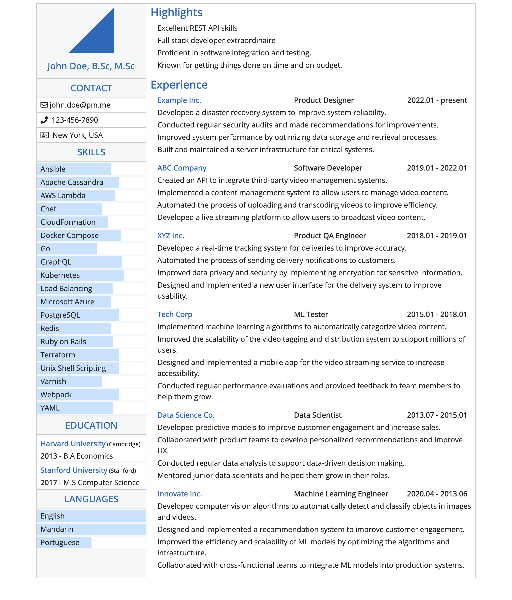

# Resume Template

Modify your data in `src/cv-data-example.yml` as needed.

### Setup
```
yarn install
```

### Compiles and hot-reloads for development
```
yarn serve
```

### Compiles and minifies for production
```
yarn build
```

### Example Resume

